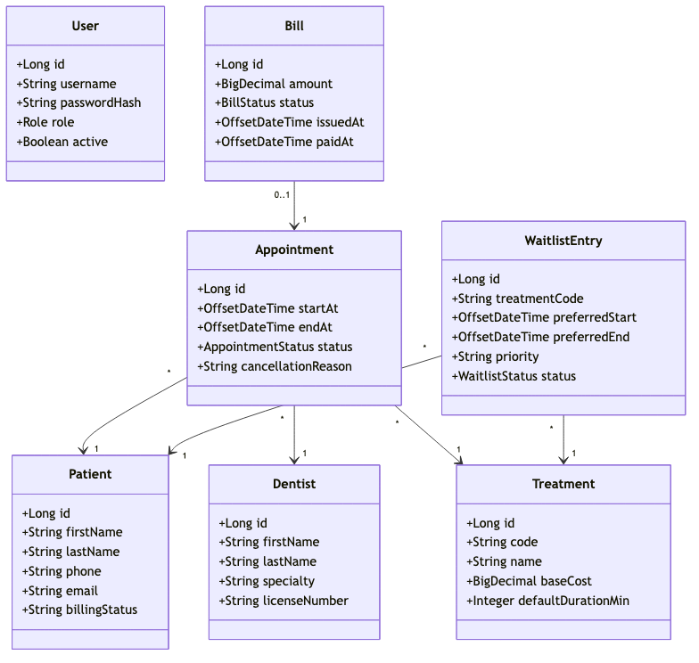
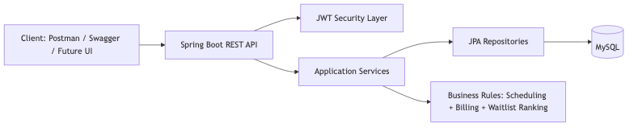
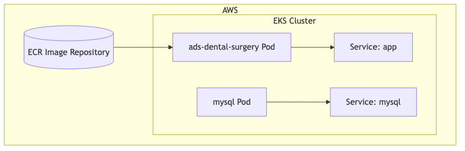
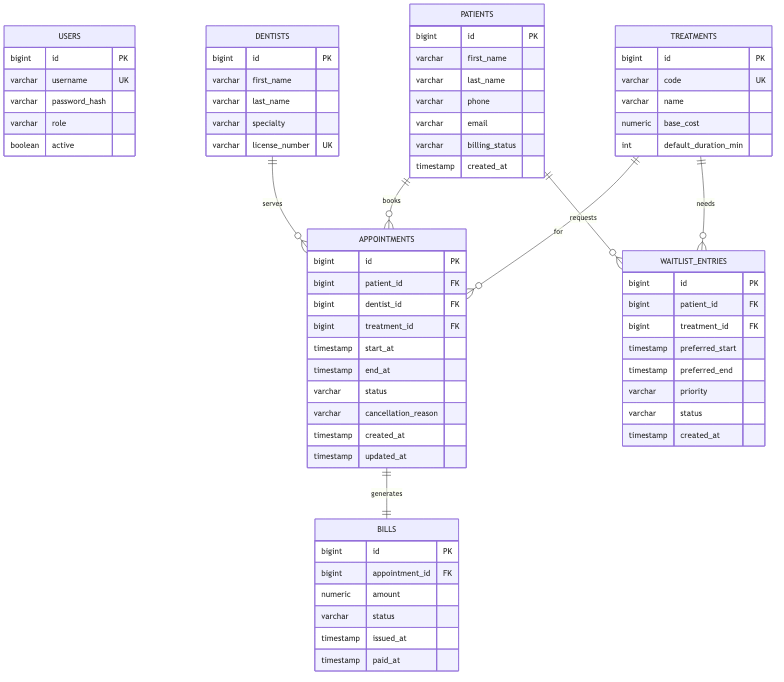
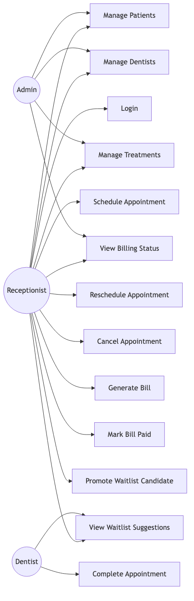

# ads-dental-surgery

Final project for the ADS dental surgery domain.

## Overview
Build a Smart Appointment and Billing API for the ADS dental surgery domain using Spring Boot, JWT auth, DTO-based contracts, tests, Docker, Kubernetes, MySQL, and EKS deployment.

## Problem Statement
Dental clinics often run separate, manual processes for appointment scheduling and billing. This causes missed appointments, longer patient wait times, billing disputes, and poor visibility for office staff.

The clinic needs one secure API-driven system that can manage appointments, manage billing, enforce business rules between scheduling and billing, and support reliable deployment in containerized and cloud environments.

## Feature Scope

### MVP Features
1. Authentication and authorization
- JWT login endpoint.
- Roles: ADMIN, DENTIST, RECEPTIONIST.
- Protected endpoints by role.

2. Core APIs
- Patients: create, read, update.
- Dentists: create, read, update.
- Treatments: create, read, update, list.
- Appointments: create, reschedule, cancel, list.
- Bills: generate from completed appointment, get status, mark paid.

3. Business rules
- Prevent overlapping appointments per dentist.
- Status flow: SCHEDULED -> COMPLETED or CANCELLED.
- Allow bill generation only for COMPLETED appointments.
- Enforce one bill per appointment.

4. Quality
- DTO-only controller boundaries.
- Unified API error model.
- Unit tests for service rules.
- Integration tests for auth + appointment + billing flow.

### Standout Feature
Smart waitlist promotion suggestions:
- Triggered after cancellation.
- Ranked by treatment fit, time-window fit, and priority.
- Includes explanation fields in response for transparent decisions.

### Non-Goals
- Full email/SMS notification platform.
- Real-time frontend app.
- Insurance adjudication complexity.
- Multi-clinic tenancy.

## Requirements / Use Cases
The solution supports the main presentation and grading requirements:
- Login and JWT-based authentication.
- Role-based access for ADMIN, DENTIST, and RECEPTIONIST.
- Patient, dentist, treatment, appointment, and billing workflows.
- Appointment rescheduling, cancellation, completion, and bill generation rules.
- Smart waitlist promotion after cancellations.

## Diagrams

### Domain Model
This class diagram shows the core entities and their relationships across patients, dentists, treatments, appointments, bills, and waitlist entries.

### High-Level Architecture
The first diagram shows the logical application layers and service flow.

The second diagram shows how the application is deployed in EKS with the MySQL database and image registry.

### Database ER Diagram
This ER diagram shows the persisted entities and the relationships used by the MySQL schema.

### Use-Case Diagram
This use-case diagram maps the project scope to the main actors and their actions.

## Tech Stack
- Java 21
- Spring Boot 3.3.x
- Spring Security and JWT
- MySQL 8.4
- Docker
- Kubernetes
- AWS EKS
